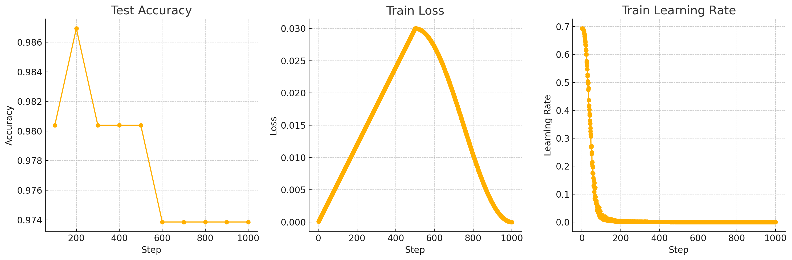

# NeuroAI-Task - Hymenoptera Dataset

This project is designed to train a model on the Hymenoptera dataset using a ViT (Vision Transformer) model using transfer learning.


### Results

The model is trained on the Hymenoptera dataset with the performance and logs visualized using TensorBoard.



| Step | Test Accuracy | Train Loss | Train Learning Rate |
|------|----------------|----------------|---------------------|
| 100  | 0.9804        | 0.00006          | 0.6934               |
| 200  | 0.9869        | 0.00012          | 0.6934               |
| 300  | 0.9804        | 0.00018          | 0.6929               |
| 400  | 0.9804        | 0.00024          | 0.6927               |
| 500  | 0.9804        | 0.00030          | 0.6920               |
| 600  | 0.9739        | 0.00036          | 0.6911               |
| 700  | 0.9739        | 0.00042          | 0.6896               |
| 800  | 0.9739        | 0.00048          | 0.6881               |
| 900  | 0.9739        | 0.00054          | 0.6851               |
| 1000| 0.9739        | 0.00060          | 0.6824               |

## Setup

Install the required dependencies:

```bash
pip install -r requirements.txt
```

Visit the ```run.ipynb``` for the complete task.

## TensorBoard Monitoring

Load TensorBoard to monitor training progress:

```python
%load_ext tensorboard
```